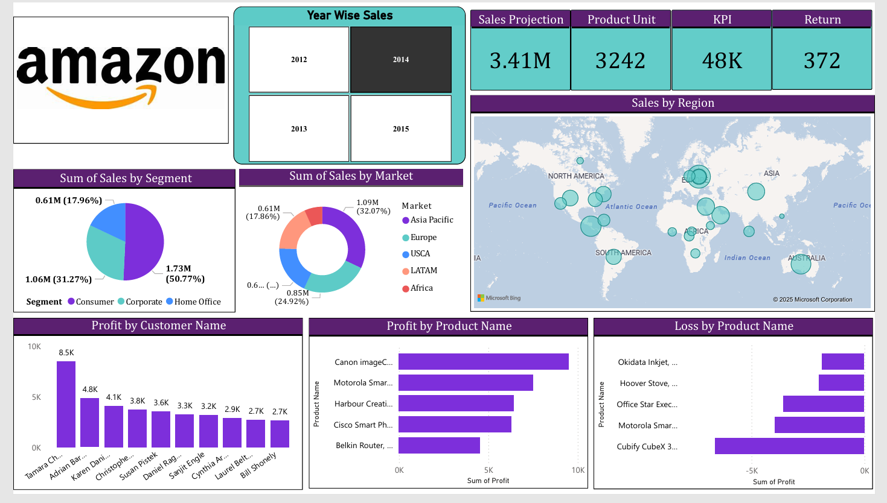

# 📊 Amazon Sales Analysis Dashboard (Power BI)

## 📌 Overview
This project is an interactive **Amazon Sales Analysis Dashboard** built using **Microsoft Power BI**.  
The dashboard provides insights into sales performance, profit analysis, regional distribution, and product-level performance.

It helps in understanding business trends, identifying top-performing products, and analyzing loss-making areas to support better business decisions.

---

## 📷 Dashboard Screenshot

--- 

## 📄 Comprehensive Business Report

A detailed business intelligence report explaining insights, impact, and strategic value:

[View Detailed Business Report](dashboard-report.pdf)

---

## 🚀 Key Features

- 📅 Year-wise Sales Analysis (2012–2015)
- 🌍 Sales by Region (Map Visualization)
- 🧩 Sales by Segment (Consumer, Corporate, Home Office)
- 🌎 Sales by Market (Asia Pacific, Europe, USA, LATAM, Africa)
- 💰 Profit by Customer Name
- 📦 Profit by Product Name
- 📉 Loss by Product Name
- 📊 KPI Cards:
  - Total Sales Projection
  - Total Product Units
  - KPI Value
  - Total Returns

---

## 🛠️ Tech Stack

- Microsoft Power BI
- Data Modeling
- DAX (Data Analysis Expressions)
- Interactive Visualizations
- KPI Cards
- Pie & Donut Charts
- Bar Charts
- Map Visualizations

---

## 📊 Dashboard Insights

This dashboard allows users to:

- Identify top profit-generating customers
- Analyze best-selling and high-profit products
- Detect loss-making products
- Compare yearly sales growth
- Understand global sales distribution visually

---

## 📈 Business Value

This project demonstrates:

- Strong data visualization skills
- Business intelligence understanding
- Analytical thinking
- Dashboard design & KPI tracking ability

--

 